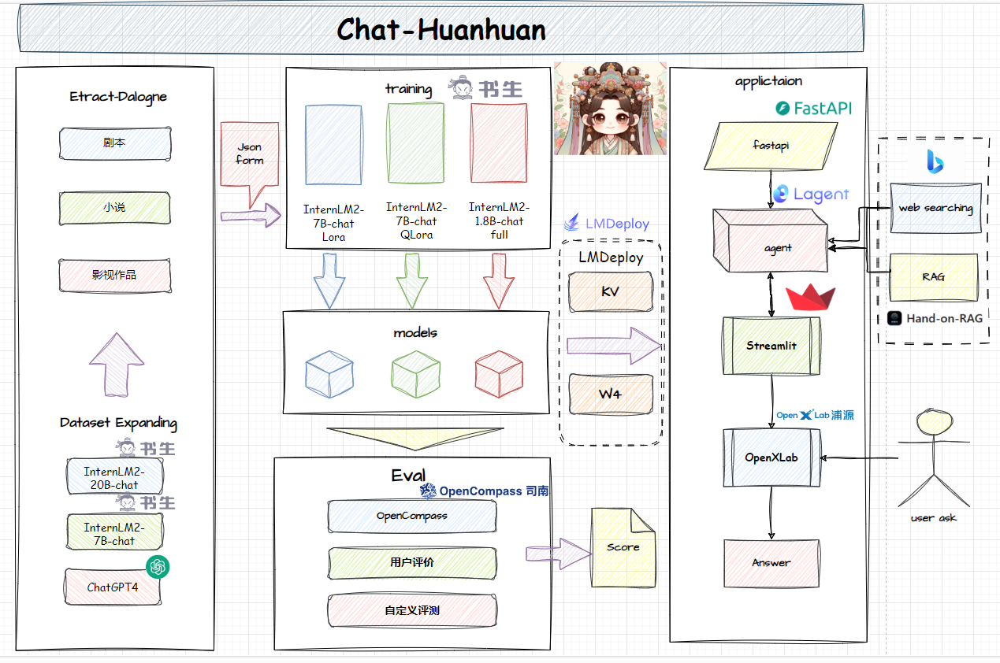
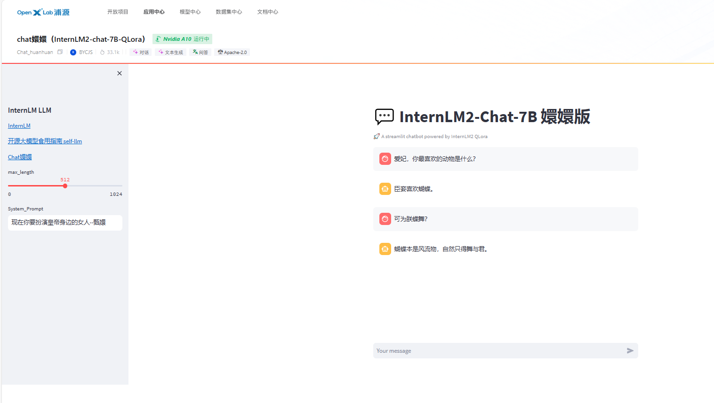
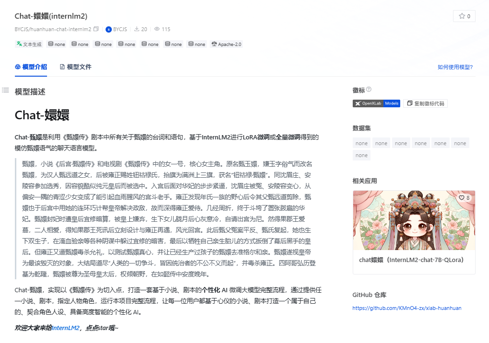

# Chat-嬛嬛
<div align="center">


  <div align="center">
    <b><font size="5">Chat-嬛嬛</font></b>
  </div>

[![license][license-image]][license-url]
[![evaluation][evaluation-image]][evaluation-url]

[🤗HuggingFace]() | [![OpenXLab_Model][OpenXLab_Model-image]][OpenXLab_Model-url] | [ ModelScope][ModelScope-url]

[![OpenXLab_App][OpenXLab_App-image]][OpenXLab_App-url] | [🆕Update News](#-news) | [🤔Reporting Issues][Issues-url] 丨 [![bilibili][bilibili-image]][bilibili-url]

[English](./README_en-US.md) | [简体中文](./README.md)


[license-image]: ./images/license.svg
[evaluation-image]: ./images/compass_support.svg
[OpenXLab_Model-image]: https://cdn-static.openxlab.org.cn/header/openxlab_models.svg
[OpenXLab_App-image]: https://cdn-static.openxlab.org.cn/app-center/openxlab_app.svg
[bilibili-image]: https://img.shields.io/badge/AMchat-bilibili-%23fb7299

[license-url]: ./LICENSE
[evaluation-url]: https://github.com/internLM/OpenCompass/
[OpenXLab_Model-url]: https://openxlab.org.cn/models/detail/BYCJS/huanhuan-chat-internlm2-1_8b
[OpenXLab_App-url]: https://openxlab.org.cn/apps/detail/BYCJS/Chat_huanhuan
[bilibili-url]: https://www.bilibili.com/video/——/
[ModelScope-url]: https://www.modelscope.cn/models/kmno4zx/huanhuan-chat-internlm2-1_8b/summary
[Issues-url]: https://github.com/KMnO4-zx/xlab-huanhuan/issues

</div>

## 📝目录

- [Chat-嬛嬛](#chat-嬛嬛)
  - [📝目录](#目录)
  - [📖 简介](#-简介)
  - [🔗 模型及体验地址](#-模型及体验地址)
  - [🚀 News](#-news)
  - [🧾 数据集](#-数据集)
  - [🛠️ 使用方法](#️-使用方法)
    - [快速开始](#快速开始)
    - [重新训练](#重新训练)
      - [环境搭建](#环境搭建)
      - [Transformers微调](#transformers微调)
      - [XTuner微调](#xtuner微调)
    - [部署](#部署)
      - [OpenXLab 部署 Chat-嬛嬛](#openxlab-部署-chat-嬛嬛)
      - [LmDeploy部署](#lmdeploy部署)
    - [测评与量化](#测评与量化)
      - [OpneCompass 评测](#opnecompass-评测)
      - [Lmdeploy\&opencompass 量化以及量化评测](#lmdeployopencompass-量化以及量化评测)
        - [`W4`量化评测](#w4量化评测)
        - [`KV Cache`量化评测](#kv-cache量化评测)
  - [💕 致谢](#-致谢)
    - [项目成员](#项目成员)
    - [特别感谢](#特别感谢)


## 📖 简介

> *此仓库主要用于将 Chat嬛嬛 项目部署到 OpenXLab 或 ModelScope 。*

&emsp;&emsp;Chat-甄嬛是利用《甄嬛传》剧本中所有关于甄嬛的台词和语句，基于[InternLM2](https://github.com/InternLM/InternLM.git)进行LoRA微调或全量微调得到的模仿甄嬛语气的聊天语言模型。

> 甄嬛，小说《后宫·甄嬛传》和电视剧《甄嬛传》中的女一号，核心女主角。原名甄玉嬛，嫌玉字俗气而改名甄嬛，为汉人甄远道之女，后被雍正赐姓钮祜禄氏，抬旗为满洲上三旗，获名“钮祜禄·甄嬛”。同沈眉庄、安陵容参加选秀，因容貌酷似纯元皇后而被选中。入宫后面对华妃的步步紧逼，沈眉庄被冤、安陵容变心，从偏安一隅的青涩少女变成了能引起血雨腥风的宫斗老手。雍正发现年氏一族的野心后令其父甄远道剪除，甄嬛也于后宫中用她的连环巧计帮皇帝解决政敌，故而深得雍正爱待。几经周折，终于斗垮了嚣张跋扈的华妃。甄嬛封妃时遭皇后宜修暗算，被皇上嫌弃，生下女儿胧月后心灰意冷，自请出宫为尼。然得果郡王爱慕，二人相爱，得知果郡王死讯后立刻设计与雍正再遇，风光回宫。此后甄父冤案平反、甄氏复起，她也生下双生子，在滴血验亲等各种阴谋中躲过宜修的暗害，最后以牺牲自己亲生胎儿的方式扳倒了幕后黑手的皇后。但雍正又逼甄嬛毒杀允礼，以测试甄嬛真心，并让已经生产过孩子的甄嬛去准格尔和亲。甄嬛遂视皇帝为最该毁灭的对象，大结局道尽“人类的一切争斗，皆因统治者的不公不义而起”，并毒杀雍正。四阿哥弘历登基为乾隆，甄嬛被尊为圣母皇太后，权倾朝野，在如懿传中安度晚年。

&emsp;&emsp;Chat-甄嬛，实现以《甄嬛传》为切入点，打造一套基于小说、剧本的**个性化 AI** 微调大模型完整流程，通过提供任一小说、剧本，指定人物角色，运行本项目完整流程，让每一位用户都基于心仪的小说、剧本打造一个属于自己的、契合角色人设、具备高度智能的个性化 AI。

> 具体如何实现全流程的 Character-AI 微调，可参考主仓库-[huanhuan-chat](https://github.com/KMnO4-zx/huanhuan-chat.git)。
> 
> 如何学习大模型部署和微调请参考：[开源大模型食用指南](https://github.com/datawhalechina/self-llm.git) 以及 [书生·浦语大模型实战营课程](https://github.com/InternLM/tutorial.git)

&emsp;&emsp;***欢迎大家来给[InternLM2](https://github.com/InternLM/InternLM.git)，点点star哦~***

Chat嬛嬛全流程如图所示：

<p align="center">
    
</p>

## 🔗 模型及体验地址

***OpenXLab 体验地址：***

***https://openxlab.org.cn/apps/detail/BYCJS/Chat_huanhuan***



***Chat-嬛嬛 模型下载地址：***

- ***OpenXLab***

***7B: https://openxlab.org.cn/models/detail/BYCJS/huanhuan-chat-internlm2***

***1.8B: https://openxlab.org.cn/models/detail/BYCJS/huanhuan-chat-internlm2-1_8b***



- ***ModelSope***

***7B: https://www.modelscope.cn/models/kmno4zx/huanhuan-chat-internlm2/summary***

***1.8B: https://www.modelscope.cn/models/kmno4zx/huanhuan-chat-internlm2-1_8b/summary***


## 🚀 News

***2月5日，完成 [InternLM2-chat-1_8B模型的全量微调](https://www.modelscope.cn/models/kmno4zx/huanhuan-chat-internlm2-1_8b/summary) ，模型已上传ModelScop2，大家可以来下载哦~***

***1月22日，Chat-嬛嬛应用在 OpenXLab，累计聊天次数已达 3.64k 次，感谢大家的支持~***

***1月22日，Chat-嬛嬛模型 魔搭 累计下载 3107 次！***


## 🧾 数据集

&emsp;&emsp;Chat-嬛嬛 数据集采用《甄嬛传》剧本中所有关于甄嬛的台词和语句，共计 3000 余条，数据集样例：

```text
第15幕
（秀女们在等候殿选。甄嬛看见了眉庄，上前相认）
甄嬛：眉姐姐！
眉庄：嬛儿，早就听说妹妹中选了，可就是一直不得空见你。
甄嬛（凑近）：我倒巴不得没选上呢。姐姐远道过来一定很辛苦吧。
眉庄：在京里休息了这些日子，早已经调养过来了。
甄嬛：如今你住在自己京城的宅子里，不比从前住在外祖家，一墙之隔，见面也方便。
眉庄：是啊。可是我总还想着我们一起长大的情分呢。诶？妹妹今日打扮得好生素净，可是细看起来还是个美人坯子，怎么看都是好的。
甄嬛：沈大美人差矣，姐姐出落得这么标致，皇上见过必定会念念不忘。
眉庄（伸手制止，左右看了下）：今天秀女佼佼者众多，我未必中选，若教旁人听见了，又要生出是非。
```

&emsp;&emsp;使用脚本将剧本中关于甄嬛的对话集抽取出来，作为数据集使用。

&emsp;&emsp;也可以使用这个仓库的脚本[Extract Dialogue](https://github.com/KMnO4-zx/extract-dialogue.git)，请GPT老师来帮助我们从小说中抽取对话集。


## 🛠️ 使用方法

### 快速开始

<!-- ## 微调 -->

1. 下载模型

<details>
<summary> 从 ModelScope </summary>

参考 [模型的下载](https://www.modelscope.cn/docs/%E6%A8%A1%E5%9E%8B%E7%9A%84%E4%B8%8B%E8%BD%BD) 。

```bash
pip install modelscope
```

```python
from modelscope.hub.snapshot_download import snapshot_download
model_dir = snapshot_download('kmno4zx/huanhuan-chat-internlm2', cache_dir='./')
```

</details>


<details>
<summary> 从 OpenXLab </summary>

参考 [下载模型](https://openxlab.org.cn/docs/models/%E4%B8%8B%E8%BD%BD%E6%A8%A1%E5%9E%8B.html) 。

```bash
pip install openxlab
```

```python
from openxlab.model import download
download(model_repo='BYCJS/huanhuan-chat-internlm2', 
        model_name='huanhuan-chat-internlm2', output='./')
```

</details>

2. 本地部署

```bash
git clone https://github.com/KMnO4-zx/xlab-huanhuan.git
python start.py
```
### 重新训练

#### 环境搭建

1. clone 本项目

```bash
git clone https://github.com/KMnO4-zx/xlab-huanhuan.git
cd xlab-huanhuan
```

2. 创建环境

```bash
pip install -r requirements.txt
```

>有两种微调方案，我们更推荐使用 XTuner 训练， XTuner 有各个模型的一键训练脚本，相对便捷。且对 InternLM2 的支持度最高。

#### Transformers微调
&emsp;&emsp;使用 Transformers 的 Trainer 进行微调，具体脚本可参考[internlm2-chat-lora](./train/internlm2-chat-lora.ipynb)，该脚本在`train`文件夹下。脚本内有较为详细的注释。

#### XTuner微调
&emsp;&emsp;使用 XTuner 进行微调，具体脚本可参考[internlm2_chat_7b_qlora_oasst1_e3_copy.py](./train/internlm2_chat_7b_qlora_oasst1_e3_copy.py)，该脚本在`train`文件夹下。脚本内有较为详细的注释。


### 部署
#### OpenXLab 部署 Chat-嬛嬛

&emsp;&emsp;仅需要 Fork 本仓库，然后在 OpenXLab 上创建一个新的项目，将 Fork 的仓库与新建的项目关联，即可在 OpenXLab 上部署 Chat-嬛嬛。

&emsp;&emsp;***OPenXLab Chat嬛嬛  https://openxlab.org.cn/apps/detail/BYCJS/Chat_huanhuan***


#### LmDeploy部署

- 首先安装LmDeploy

```shell
pip install -U lmdeploy
```

- 然后转换模型为`turbomind`格式

> --dst-path: 可以指定转换后的模型存储位置。

```shell
lmdeploy convert internlm2-chat-7b  要转化的模型地址 --dst-path 转换后的模型地址
```

- LmDeploy Chat 对话

```shell
lmdeploy chat turbomind 转换后的turbomind模型地址
```
### 测评与量化
#### OpneCompass 评测

- 安装 OpenCompass

```shell
git clone https://github.com/open-compass/opencompass
cd opencompass
pip install -e .
```

- 下载解压数据集

```shell
cp /share/temp/datasets/OpenCompassData-core-20231110.zip /root/opencompass/
unzip OpenCompassData-core-20231110.zip
```

- 评测启动！

```shell
python run.py \
    --datasets ceval_gen \
    --hf-path /root/model/huanhuan/kmno4zx/huanhuan-chat-internlm2 \
    --tokenizer-path /root/model/huanhuan/kmno4zx/huanhuan-chat-internlm2 \
    --tokenizer-kwargs padding_side='left' truncation='left'     trust_remote_code=True \
    --model-kwargs device_map='auto' trust_remote_code=True \
    --max-seq-len 2048 \
    --max-out-len 16 \
    --batch-size 2  \
    --num-gpus 1 \
    --debug
```

#### Lmdeploy&opencompass 量化以及量化评测  
##### `W4`量化评测  

- `W4`量化
```shell
lmdeploy lite auto_awq 要量化的模型地址 --work-dir 量化后的模型地址
```
- 转化为`TurbMind`
```shell
lmdeploy convert internlm2-chat-7b 量化后的模型地址  --model-format awq --group-size 128 --dst-path 转换后的模型地址
```
- 评测`config`编写  
```python
from mmengine.config import read_base
from opencompass.models.turbomind import TurboMindModel

with read_base():
 # choose a list of datasets   
 from .datasets.ceval.ceval_gen import ceval_datasets 
 # and output the results in a choosen format
#  from .summarizers.medium import summarizer

datasets = [*ceval_datasets]

internlm2_chat_7b = dict(
     type=TurboMindModel,
     abbr='internlm2-chat-7b-turbomind',
     path='转换后的模型地址',
     engine_config=dict(session_len=512,
         max_batch_size=2,
         rope_scaling_factor=1.0),
     gen_config=dict(top_k=1,
         top_p=0.8,
         temperature=1.0,
         max_new_tokens=100),
     max_out_len=100,
     max_seq_len=512,
     batch_size=2,
     concurrency=1,
     #  meta_template=internlm_meta_template,
     run_cfg=dict(num_gpus=1, num_procs=1),
)
models = [internlm2_chat_7b]

```
- 评测启动！
```shell
python run.py configs/eval_turbomind.py -w 指定结果保存路径
```
##### `KV Cache`量化评测 
- 转换为`TurbMind`
```shell
lmdeploy convert internlm2-chat-7b  模型路径 --dst-path 转换后模型路径
```
- 计算与获得量化参数
```shell
# 计算
lmdeploy lite calibrate 模型路径 --calib-dataset 'ptb' --calib-samples 128 --calib-seqlen 2048 --work-dir 参数保存路径
# 获取量化参数
lmdeploy lite kv_qparams 参数保存路径 转换后模型路径/triton_models/weights/ --num-tp 1
```
- 更改`quant_policy`改成`4`,更改上述`config`里面的路径
- 评测启动！
```shell
python run.py configs/eval_turbomind.py -w 结果保存路径
```
结果文件可在同目录文件[results](./results)中获取

## 💕 致谢

### 项目成员

- 宋志学-项目负责人 （Datawhale成员 书生·浦语实战营助教 负责项目规划，数据集制作及模型训练）
- 肖鸿儒（Datawhale成员 书生·浦语实战营助教 负责数据集收集、模型评测）
- 邹雨衡（Datawhale成员 负责数据集收集）
- 杜森（Datawhale成员 负责数据集收集）

### 特别感谢

<div align="center">

***感谢上海人工智能实验室组织的 书生·浦语实战营 学习活动~***

***感谢 OpenXLab 对项目部署的算力支持~***

***感谢 浦语小助手 对项目的支持~***
</div>
